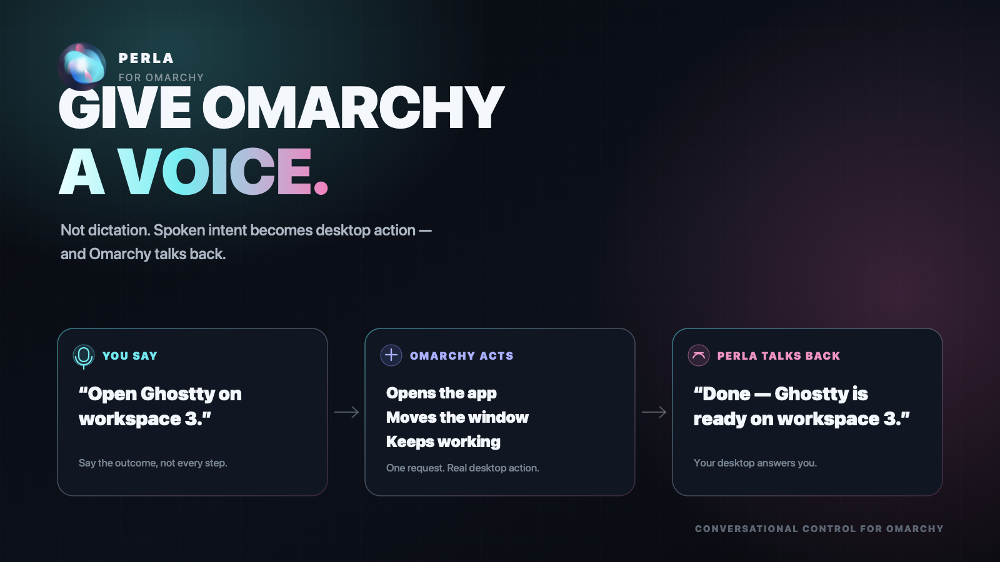

# Perla

**Give Omarchy a voice.**

Perla does not just dictate into a text box. Talk naturally and it can
understand what you want, act across your Omarchy desktop, and talk back when
the work is done.



| Keyboard | Your voice |
|---|---|
| ~45 words/min | ~150 words/min |

Perla lives in the Omarchy bar, while a local Rust daemon handles the realtime
voice session. Voxtype remains your dictation tool; Perla is for conversations,
desktop actions, and spoken results.

## Install

```sh
omarchy plugin add https://github.com/inawafalm/omarchy-perla --enable
```

A pearl appears in your bar. Click it and press **Set up Perla**.

That opens a terminal — you watch every command run and can cancel at any
point — and it installs the `perla-d` voice daemon into `~/.local/bin`, enables
`perla.service` for your user, and pulls in any Arch package you are missing.
A prebuilt daemon is downloaded and checksummed, so this normally takes seconds
rather than a Rust compile. Flip **Computer use** on first if you also want
Perla to see the screen, click, and type.

`omarchy plugin add` deliberately copies files and runs nothing — no install
hooks, no sudo. That is why the last step is a button you press rather than
something that happens behind your back.

When it finishes, right-click the orb, choose OpenAI or Grok and a realtime
model, paste your own API key into the password field, and save. Perla never
ships with a shared API key.

### Without the panel

The same script runs fine on its own — useful over SSH, or if you would rather
read it before it runs:

```sh
~/.config/omarchy/plugins/nawaf.perla/bin/perla-setup --help
~/.config/omarchy/plugins/nawaf.perla/bin/perla-setup
```

`--with-computer-use` adds the harness, `--from-source` compiles the daemon out
of the checkout instead of downloading it, and `--yes` skips the confirmation.
Re-running it is safe; it only installs what is actually missing.

### Optional hotkeys

```ini
bind = SUPER ALT, SPACE, exec, perla-d toggle-listen
bind = SUPER SHIFT, BackSpace, exec, sh -c 'perla-d mute; omarchy-harness stop'
```

The second binding is a panic switch: it mutes Perla and stops computer use.
Perla does not take Voxtype's F9 or Super+Ctrl+X bindings.

## Privacy and security

- There are no API keys, credentials, or Perla relay servers in this repository.
- Your key is sent to `perla-d` over stdin, never a process argument, and stored
  only in `~/.config/perla-voice/config.toml` with mode `0600`.
- The control socket, runtime state, and local transcript/tool log are restricted
  to your user. Public state exposes only booleans such as `has_openai_key`.
- Microphone audio goes directly from your machine to the provider you select
  (OpenAI or xAI). Your own provider account pays the API usage.
- Computer use can capture the screen, click, and type as your Linux user.
  Plugins run as unsandboxed QML inside `omarchy-shell`; review the source and
  use the panic switch if anything looks wrong.
- The local debug trail contains what you said, Perla's replies, and tool calls.
  It is never uploaded by Perla; `Copy debug log` shares it only when you ask.

Cost controls are enabled by default: the efficient realtime model, bounded
context, cache-friendly truncation, short spoken replies, one-turn screenshot
cleanup, completion-only progress, idle shutdown, and pre-cap session rotation.

## Controls

- Left-click the orb: compact listen/mute controls.
- Right-click: settings and model drawer.
- Voice model: pick a provider model without editing config files.
- Spoken progress: completion only, major milestones, or every step.
- Reply language: automatic or pinned to your preferred language.

Provider, model, progress mode, and start-muted changes reload the daemon. If a
session was active, Perla reconnects automatically.

## Remove

In the panel, right-click the orb and press **Uninstall the daemon…**, or run
the same script yourself:

```sh
~/.config/omarchy/plugins/nawaf.perla/bin/perla-uninstall
omarchy plugin remove nawaf.perla
```

That stops and deletes the user service, the daemon, and the harness. Your key
and local history are kept on purpose — add `--purge` to delete
`~/.config/perla-voice`, `~/.local/state/perla`, and `~/.local/share/perla` too.

## Development

```sh
node test-model.js
cargo test --manifest-path perla-voice/Cargo.toml --workspace
uv run --with pytest --with ./omarchy-harness python -m pytest omarchy-harness/tests
```

License: MIT. Copyright 2026 Nawaf.
